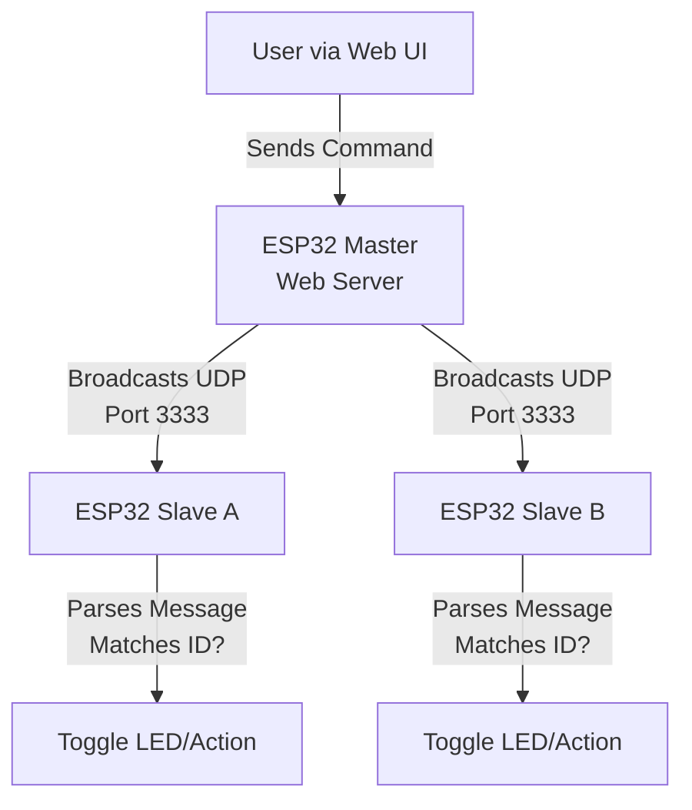

# 📡 ESP32 UDP Communication Network

A robust and scalable project demonstrating **UDP-based communication** between multiple ESP32 microcontrollers over a Wi-Fi network. A **Master ESP32** hosts a web interface for user interaction and broadcasts commands to **Slave ESP32s**, which process these commands (e.g., toggling LEDs) based on unique identifiers. This project is designed for IoT applications, offering modularity, efficiency, and real-time control.

---

## 📋 Table of Contents

- [Project Overview](#project-overview)
- [Features](#features)
- [Use Cases](#use-cases)
- [Project Structure](#project-structure)
- [Hardware Requirements](#hardware-requirements)
- [Software Requirements](#software-requirements)
- [Installation Guide](#installation-guide)
- [How It Works](#how-it-works)
- [Workflow Diagram](#workflow-diagram)
- [Running the Project](#running-the-project)
- [Code Enhancements](#code-enhancements)
- [Troubleshooting](#troubleshooting)
- [Expansion Ideas](#expansion-ideas)
- [What I Learned](#what-i-learned)
- [Contributing](#contributing)
- [License](#license)
- [Contact](#contact)

---

## 🛰️ Project Overview

This project showcases a lightweight, non-blocking **UDP communication network** for ESP32 boards connected via Wi-Fi. The **Master ESP32** serves a web-based user interface and broadcasts commands to multiple **Slave ESP32s**, which respond to specific commands, such as toggling LEDs or processing sensor data. The system is designed to be modular, scalable, and suitable for real-time IoT applications.

---

## ✨ Features

- **Web-based Control Interface**: Intuitive UI hosted on the Master ESP32 for seamless user interaction.
- **Non-blocking UDP Communication**: Leverages `AsyncUDP` for efficient, asynchronous data transfer.
- **Dynamic Device Discovery**: Uses UDP broadcasts to communicate with all slaves without static IPs.
- **Modular Design**: Easily expandable to support additional slaves or custom functionalities.
- **Example Application**: Demonstrates LED control, extensible to sensors, actuators, or other peripherals.

---

## 💼 Use Cases

- **Home Automation**: Control lights, fans, or appliances remotely.
- **Sensor Networks**: Aggregate data from multiple ESP32-based sensors in real time.
- **IoT Prototyping**: Build scalable IoT systems for educational or industrial demonstrations.
- **Real-time Systems**: Enable low-latency communication for time-sensitive applications.

---

## 📁 Project Structure

| File Name                            | Description                                            |
|--------------------------------------|-------------------------------------------------------|
| `01_Test_Send_and_Receive_ESP32_Master.ino` | Basic Master sketch for sending test UDP packets.      |
| `02_Test_Send_and_Receive_ESP32_Slave.ino`  | Basic Slave sketch for receiving and responding to UDP packets. |
| `03_ESP32_UDP_Web_Server_Master.ino` | Master sketch with web server for user control and broadcasting. |
| `04_ESP32_UDP_ESP32A_or_Slave_A.ino` | Slave A sketch, responds to specific UDP commands.     |
| `05_ESP32_UDP_ESP32B_or_Slave_B.ino` | Slave B sketch, with unique identifier-based responses. |
| `PageIndex.h`                        | Header file containing HTML template for the Master’s web interface. |
| `Installation.png`                   | Diagram illustrating wiring and hardware setup.        |

---

## 🧰 Hardware Requirements

- **ESP32 Boards**: Minimum of 2 (1 Master, 1+ Slaves).
- **LEDs and Resistors**: For testing (e.g., 220Ω resistors with LEDs).
- **Breadboard and Jumper Wires**: For prototyping connections.
- **USB Cables**: For programming and powering ESP32 boards.
- **Optional**: Power bank or external 5V power supply for standalone operation.

---

## 💻 Software Requirements

- **Arduino IDE**: Version 2.0 or later recommended.
- **ESP32 Board Support**: Install via Arduino IDE Boards Manager.
- **Libraries**:
  - `WiFi.h`: For Wi-Fi connectivity.
  - `AsyncUDP.h`: For non-blocking UDP communication.
  - `ESPAsyncWebServer.h`: For hosting the web interface (optional for advanced UI).
  - `ESPmDNS.h`: For device discovery (optional, see [Code Enhancements](#code-enhancements)).
  - `ArduinoJson.h`: For structured message parsing (optional, see [Code Enhancements](#code-enhancements)).

---

## 📥 Installation Guide

1. **Install Arduino IDE**:
   - Download and install from [arduino.cc](https://www.arduino.cc/en/software).
   - Add ESP32 board support via Boards Manager (URL: `https://raw.githubusercontent.com/espressif/arduino-esp32/master/package/package_esp32_index.json`).

2. **Install Libraries**:
   - Open Arduino IDE, go to `Sketch > Include Library > Manage Libraries`.
   - Install `AsyncUDP`, `ESPAsyncWebServer`, `ESPmDNS`, and `ArduinoJson`.

3. **Configure Master**:
   - Open `03_ESP32_UDP_Web_Server_Master.ino`.
   - Include `PageIndex.h` in the sketch:
     ```cpp
     #include "PageIndex.h"
     ```
   - Update Wi-Fi credentials:
     ```cpp
     const char* ssid = "YOUR_WIFI_SSID";
     const char* password = "YOUR_WIFI_PASSWORD";
     ```
   - Upload to the Master ESP32.

4. **Configure Slaves**:
   - Open `04_ESP32_UDP_ESP32A_or_Slave_A.ino` and `05_ESP32_UDP_ESP32B_or_Slave_B.ino`.
   - Update Wi-Fi credentials as above.
   - Upload to respective Slave ESP32 boards.

5. **Hardware Setup**:
   - Connect LEDs to GPIO pins 12 and 13 on each Slave (with 220Ω resistors).
   - Ensure all ESP32s are powered via USB or external 5V supply.

---

## ⚙️ How It Works

- **Master ESP32**:
  - Connects to the Wi-Fi network and starts a web server.
  - Serves a web interface defined in `PageIndex.h` for user interaction.
  - Sends UDP broadcast messages to port `3333` based on user input (e.g., `LED1_ON`).
- **Slave ESP32s**:
  - Connect to the same Wi-Fi network and listen for UDP packets on port `3333`.
  - Parse incoming messages and perform actions (e.g., toggle LEDs) if the message matches their ID.
- **Communication**:
  - Uses UDP broadcasts to send commands to all slaves simultaneously.
  - Slaves filter messages based on identifiers or content.

---

## 🔁 Workflow Diagram



---

## ▶️ Running the Project

1. **Power On Devices**:
   - Connect all ESP32 boards to power via USB or external supply.
   - Ensure they connect to the same Wi-Fi network.

2. **Get Master IP**:
   - Open Arduino IDE Serial Monitor (115200 baud) for the Master ESP32.
   - Note the IP address printed after Wi-Fi connection.

3. **Access Web Interface**:
   - Open a browser and navigate to `http://<MASTER_IP>`.
   - Use the web interface buttons to send commands (e.g., turn LED1 ON/OFF).

4. **Observe Slave Responses**:
   - Monitor LEDs on Slave ESP32s to confirm command execution.
   - Use Serial Monitor on Slaves for debugging.

---

## 🧠 Code Enhancements

To make the project more efficient and professional, the following enhancements are recommended (with example snippets):

### 1. JSON-based Message Structure
Use `ArduinoJson` to structure UDP messages for better parsing and scalability.

```cpp
#include <ArduinoJson.h>

void sendUDPCommand(String target, String action) {
  StaticJsonDocument<200> doc;
  doc["target"] = target; // e.g., "SLAVE_A"
  doc["action"] = action; // e.g., "LED_ON"
  char buffer[200];
  serializeJson(doc, buffer);
  udp.broadcastTo(buffer, 3333);
}
```

**Slave Parsing Example**:
```cpp
void onPacket(AsyncUDPPacket packet) {
  StaticJsonDocument<200> doc;
  deserializeJson(doc, packet.data(), packet.length());
  String target = doc["target"];
  String action = doc["action"];
  if (target == "SLAVE_A" && action == "LED_ON") {
    digitalWrite(LED_PIN, HIGH);
  }
}
```

### 2. Acknowledgment (ACK) Packets
Slaves send confirmation back to the Master to ensure reliable communication.

```cpp
void sendACK(String slaveID) {
  StaticJsonDocument<100> doc;
  doc["type"] = "ACK";
  doc["slave"] = slaveID;
  char buffer[100];
  serializeJson(doc, buffer);
  udp.writeTo(buffer, packet.remoteIP(), 3333);
}
```

### 3. mDNS for Device Discovery
Use `ESPmDNS` to assign hostnames, eliminating the need to manually find the Master’s IP.

```cpp
#include <ESPmDNS.h>

void setupMDNS() {
  if (MDNS.begin("esp32-master")) {
    Serial.println("mDNS started: esp32-master.local");
  }
}
```

Users can access the web interface at `http://esp32-master.local`.

### 4. Styled Web Interface
Enhance `PageIndex.h` with Tailwind CSS for a modern, responsive UI.

```html
<!DOCTYPE html>
<html>
<head>
  <title>ESP32 Control Panel</title>
  <script src="https://cdn.tailwindcss.com"></script>
</head>
<body class="bg-gray-100 flex justify-center items-center h-screen">
  <div class="bg-white p-6 rounded-lg shadow-lg">
    <h1 class="text-2xl font-bold mb-4">ESP32 Control Panel</h1>
    <button onclick="sendCommand('SLAVE_A', 'LED_ON')" class="bg-blue-500 hover:bg-blue-700 text-white font-bold py-2 px-4 rounded">
      Turn ON Slave A LED
    </button>
    <button onclick="sendCommand('SLAVE_A', 'LED_OFF')" class="bg-red-500 hover:bg-red-700 text-white font-bold py-2 px-4 rounded">
      Turn OFF Slave A LED
    </button>
  </div>
  <script>
    function sendCommand(target, action) {
      fetch(`/${target}/${action}`).then(res => console.log("Command sent!"));
    }
  </script>
</body>
</html>
```

---

## 🐞 Troubleshooting

- **Wi-Fi Connection Issues**:
  - Ensure all ESP32s are on the same subnet and Wi-Fi credentials are correct.
  - Check Serial Monitor for connection errors.
- **UDP Packet Loss**:
  - Verify port `3333` is not blocked by the network.
  - Increase delay between broadcasts (e.g., 100ms).
- **Web Interface Inaccessible**:
  - Confirm the Master’s IP address via Serial Monitor.
  - Check if `ESPAsyncWebServer` is properly installed and `PageIndex.h` is included.
- **LEDs Not Responding**:
  - Verify GPIO pin assignments and wiring.
  - Ensure slaves are receiving UDP packets (use Serial Monitor).

---

## 🔭 Expansion Ideas

- **Sensor Integration**: Add temperature, humidity, or motion sensors to slaves and send data back to the Master.
- **OTA Updates**: Implement Over-The-Air updates using `ArduinoOTA` for seamless firmware updates.
- **Multicast Instead of Broadcast**: Use multicast groups to reduce network load.
- **Mobile App UI**: Develop a mobile app using Flutter or React Native to replace the web interface.
- **Secure Communication**: Add encryption (e.g., AES) or use secure Wi-Fi with WPA2.

---

## 📘 What I Learned

- **Asynchronous UDP**: Using `AsyncUDP` enables efficient, non-blocking communication for IoT.
- **Web Server Integration**: Hosting a web server on ESP32 simplifies user interaction.
- **Modular IoT Design**: Structuring code for scalability supports additional devices and features.
- **UDP vs. TCP**: Learned the trade-offs between lightweight UDP and reliable TCP for IoT applications.
- **Network Debugging**: Gained practical experience using Serial Monitor and network tools to troubleshoot.

---

## 🤝 Contributing

Contributions are welcome! To contribute:

1. Fork the repository.
2. Create a new branch (`git checkout -b feature/your-feature`).
3. Commit your changes (`git commit -m "Add your feature"`).
4. Push to the branch (`git push origin feature/your-feature`).
5. Open a Pull Request.

Please report bugs or suggest features via GitHub Issues.

---

## ⚖️ License

This project is licensed under the [MIT License](LICENSE).

---

## 📬 Contact

- **Name**: Ronit Paikray
- **GitHub**: [Ronit-Paikray](https://github.com/Ronit-Paikray)
- **Email**: [Ronitpaikray6@gmail.com](mailto:Ronitpaikray6@gmail.com)

---

## 🧠 Final Thoughts

This project provides a **solid foundation** for building multi-device IoT systems. With UDP’s lightweight nature and the ESP32’s versatility, you can create efficient, real-time applications like home automation, sensor networks, or industrial monitoring. Explore the [Expansion Ideas](#expansion-ideas) to take it further!

> "With a few ESP32s and some code, you can orchestrate a network of devices to bring your IoT ideas to life!"
